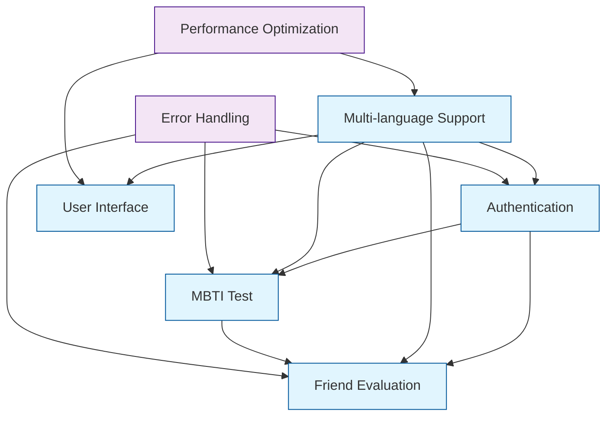
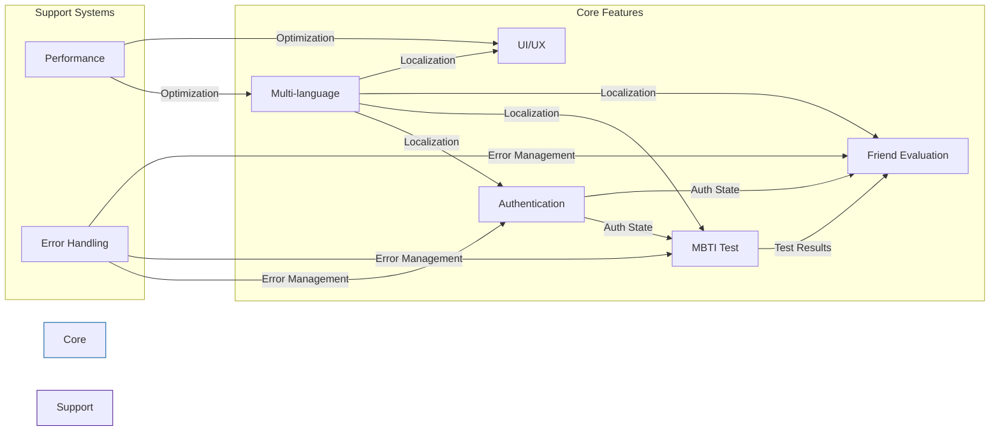
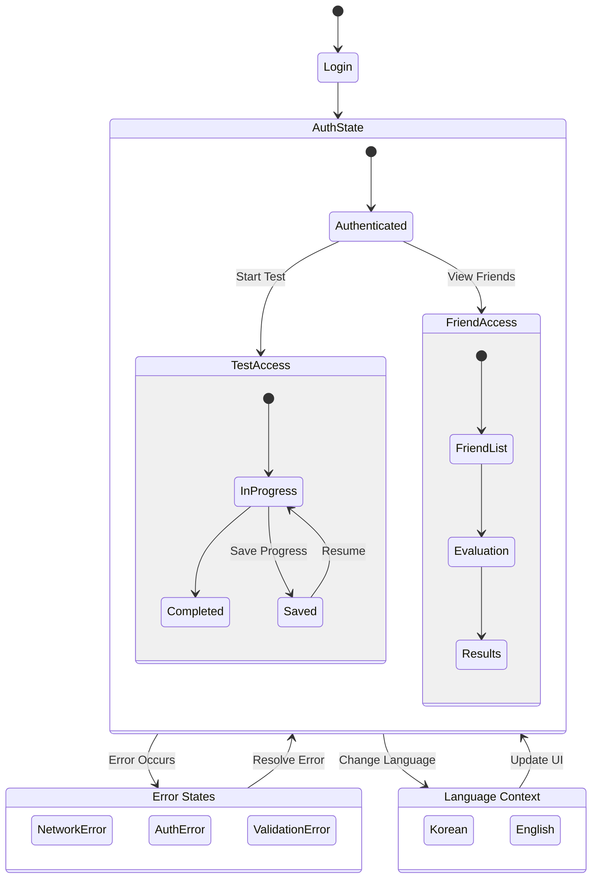

# Features Documentation

## Feature Relationship Diagrams

### Core Feature Dependencies

### Feature Impact Flow

### State Management Flow

## Core Features

### 1. Authentication
📁 Related Files:
- [KakaoLogin.tsx](../src/components/KakaoLogin.tsx) - KakaoTalk login component
- [OAuthHandler.tsx](../src/OAuthHandler.tsx) - OAuth authentication handler
- [App.tsx](../src/App.tsx) - Authentication state management

🔗 Dependencies:
- [Multi-language Support](#4-multi-language-support) - Login UI localization
- [Error Handling](#error-handling) - Authentication failure handling
- [Friend Evaluation](#3-friend-evaluation) - Friend list access permissions

⚠️ Impact Areas:
- Authentication state changes affect Friend Evaluation feature accessibility
- Session expiration requires saving ongoing test data
- Permission scope determines Friend Evaluation feature availability

### 2. MBTI Test
📁 Related Files:
- [QuestionCard.tsx](../src/components/QuestionCard.tsx) - Question display component
- [ProgressBar.tsx](../src/components/ProgressBar.tsx) - Progress tracking
- [questionBank.ts](../src/data/questionBank.ts) - Question data

🔗 Dependencies:
- [Authentication](#1-authentication) - User identification and result storage
- [Multi-language Support](#4-multi-language-support) - Question and result localization
- [Performance Optimization](#performance-optimization) - Question loading optimization

⚠️ Impact Areas:
- Language changes require maintaining test progress state
- Result storage requires authentication state verification
- Network status affects offline mode support

### 3. Friend Evaluation
📁 Related Files:
- [TypeCard.tsx](../src/components/TypeCard.tsx) - MBTI type card display
- [types/mbti.ts](../src/types/mbti.ts) - MBTI type definitions

🔗 Dependencies:
- [Authentication](#1-authentication) - Friend list access permissions
- [MBTI Test](#2-mbti-test) - Evaluation logic and result display
- [Error Handling](#error-handling) - Permission error handling

⚠️ Impact Areas:
- Authentication permission changes affect feature accessibility
- MBTI Test logic changes require evaluation system updates
- Friend list sync status affects UI display

### 4. Multi-language Support
📁 Related Files:
- [types/language.ts](../src/types/language.ts) - Language types and translations
- [index.html](../index.html) - Default language settings

🔗 Dependencies:
- [Performance Optimization](#performance-optimization) - Language resource loading
- [User Interface](#5-user-interface) - Layout adjustments for language switching

⚠️ Impact Areas:
- Text display in all UI components
- Error messages and system notifications
- Data input/output formatting

### 5. User Interface
📁 Related Files:
- [index.css](../src/index.css) - Global styles
- [tailwind.config.js](../tailwind.config.js) - Tailwind configuration

🔗 Dependencies:
- [Multi-language Support](#4-multi-language-support) - Layout direction and fonts
- [Performance Optimization](#performance-optimization) - Responsive resource management

⚠️ Impact Areas:
- Visual representation of all features
- Accessibility and usability
- Device compatibility

## Error Handling
📁 Related Files:
- [App.tsx](../src/App.tsx) - Global error handling
- [OAuthHandler.tsx](../src/OAuthHandler.tsx) - Authentication error handling

🔗 Dependencies:
- [Authentication](#1-authentication) - Authentication error processing
- [Multi-language Support](#4-multi-language-support) - Error message localization

⚠️ Impact Areas:
- Error state management for all features
- User feedback display
- System stability

## Performance Optimization
📁 Related Files:
- [vite.config.ts](../vite.config.ts) - Build optimization settings
- [tsconfig.json](../tsconfig.json) - TypeScript configuration

🔗 Dependencies:
- [User Interface](#5-user-interface) - Resource loading strategy
- [Multi-language Support](#4-multi-language-support) - Language resource optimization

⚠️ Impact Areas:
- Overall application performance
- Resource utilization
- Loading times

## Feature Modification Checklist
1. Review impact on dependent features
2. Synchronize changes across related files
3. Verify multi-language support impact
4. Update error handling logic
5. Review performance optimization impact
6. Maintain UI/UX consistency
7. Update test cases 